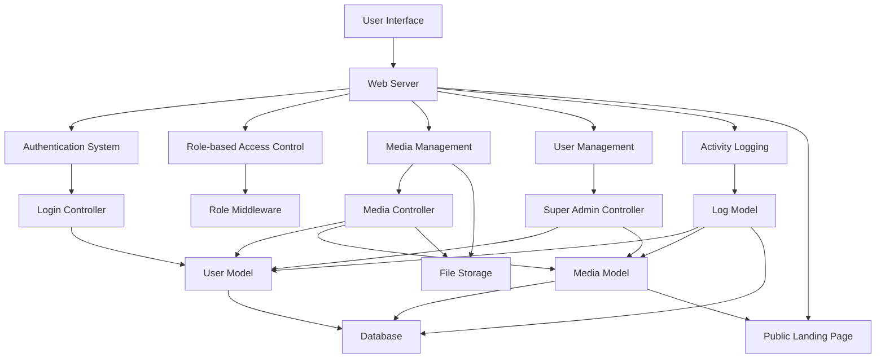
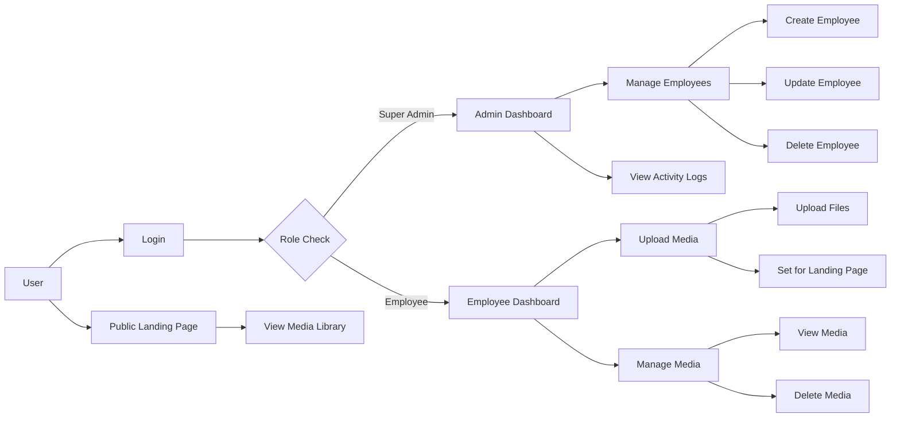
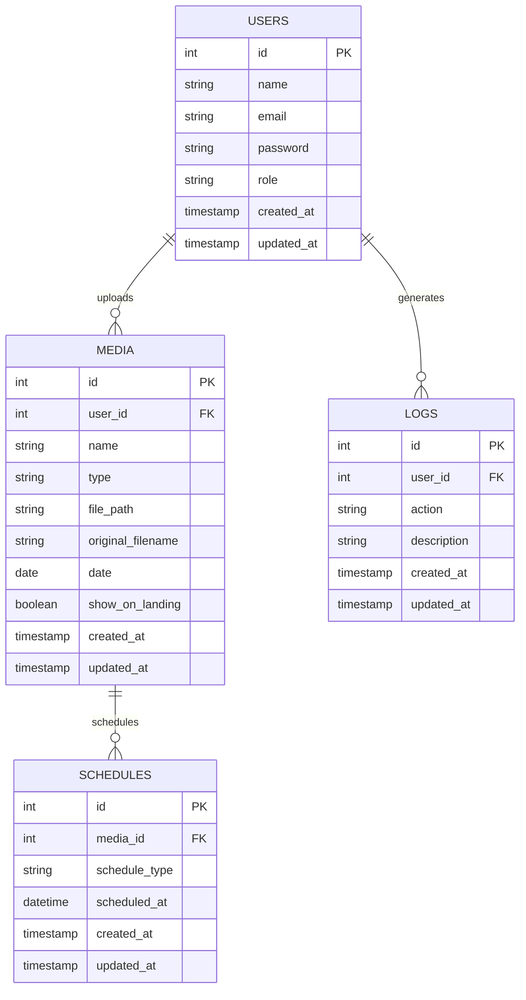

# Tambodia System Architecture

## Component Diagram

```mermaid
graph TD
    A[User Interface] --> B[Web Server]
    B --> C[Authentication System]
    B --> D[Role-based Access Control]
    B --> E[Media Management]
    B --> F[User Management]
    B --> G[Activity Logging]
    
    C --> H[Login Controller]
    D --> I[Role Middleware]
    E --> J[Media Controller]
    F --> K[Super Admin Controller]
    G --> L[Log Model]
    
    H --> M[User Model]
    J --> M
    K --> M
    L --> M
    
    J --> N[Media Model]
    K --> N
    L --> N
    
    N --> O[Database]
    M --> O
    L --> O
    
    E --> P[File Storage]
    J --> P
    
    B --> Q[Public Landing Page]
    N --> Q
```

## User Workflow

```mermaid
graph LR
    A[User] --> B[Login]
    B --> C{Role Check}
    C -->|Super Admin| D[Admin Dashboard]
    C -->|Employee| E[Employee Dashboard]
    D --> F[Manage Employees]
    D --> G[View Activity Logs]
    E --> H[Upload Media]
    E --> I[Manage Media]
    A --> J[Public Landing Page]
    
    F --> K[Create Employee]
    F --> L[Update Employee]
    F --> M[Delete Employee]
    
    H --> N[Upload Files]
    H --> O[Set for Landing Page]
    
    I --> P[View Media]
    I --> Q[Delete Media]
    
    J --> R[View Media Library]
```

## Database Schema

```mermaid
erDiagram
    USERS ||--o{ MEDIA : uploads
    USERS ||--o{ LOGS : generates
    MEDIA ||--o{ SCHEDULES : schedules
    
    USERS {
        int id PK
        string name
        string email
        string password
        string role
        timestamp created_at
        timestamp updated_at
    }
    
    MEDIA {
        int id PK
        int user_id FK
        string name
        string type
        string file_path
        string original_filename
        date date
        boolean show_on_landing
        timestamp created_at
        timestamp updated_at
    }
    
    LOGS {
        int id PK
        int user_id FK
        string action
        string description
        timestamp created_at
        timestamp updated_at
    }
    
    SCHEDULES {
        int id PK
        int media_id FK
        string schedule_type
        datetime scheduled_at
        timestamp created_at
        timestamp updated_at
    }
```